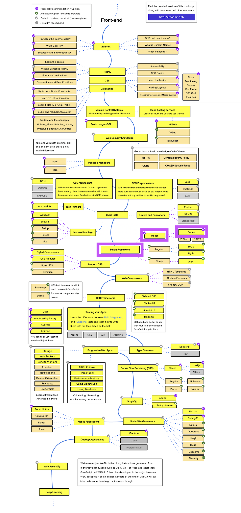

# 1. はじめに

- *Up: [目次](../index.md)*
- *Next: [2. webアプリのしくみ](./02_web_app.md)*

## 講義の目的

- UIの状態管理の基礎を理解する
- 大規模なUIの開発に適した手法を学ぶ

## 講義の位置

[2022フロントエンド技術ロードマップ](https://roadmap.sh/frontend)
reduxは、Reactとともに「フレームワーク選定」に属している。

