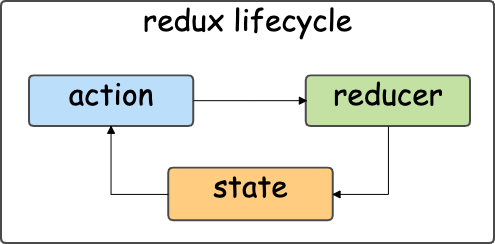

# reduxの特徴

- *Back: [webアプリのしくみ](./02_web_app.md)*
- *Next: [reduxライフサイクルの構成](./04_lifecycle.md)*

## redux lifecycle

reduxには厳密なルールがある。

それは、UIの状態変化を決められたサイクル(redux lifecycle)で表現するというものである。

このルールを守ることで、依存関係が一方向にのみ伝達されることが保証される。

## reduxの思想

redux は長期的な DX (developer's experience) にフォーカスしている。

例えば、redux は以下のような原則で理解することができる。
- [繰り返しの排除 (DRY)](https://ja.wikipedia.org/wiki/Don%27t_repeat_yourself)
  - 例: action creator
- [関心の分離](https://ja.wikipedia.org/wiki/%E9%96%A2%E5%BF%83%E3%81%AE%E5%88%86%E9%9B%A2)
  - 例: 非同期処理のカプセル化

## 長所

- redux lifecycleのルール通りに実装すれば迷いにくい
- React/reduxの実装例を見つけやすい
- React以外のライブラリにも対応している

## 短所

- 小さいwebアプリには必要ない and 向いていない
  - React hooksで済む場合が多い
- 短期的には生産性が低い
  - ルールが多い
  - 学習曲線がゆるい
