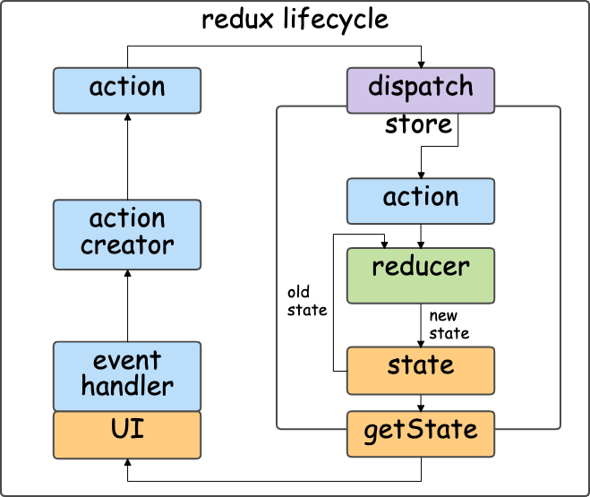

# reduxライフサイクルの構成

- *Back: [reduxの特徴](./03_feature.md)*
- *Next: [reduxライフサイクル - action](./05_lifecycle_action.md)*

## 概要

redux は web アプリを以下の要素に分割する。

- [`store`](./lifecycle_store.md)
  - `dispatch`: イベントを実行するメソッド
  - `getState`: UIの状態を取得するメソッド
    - `state`: UIの状態（`getState`でしか取得できない）
- [`action`](./lifecycle_action.md): UIのイベント
- [`reducer`](./lifecycle_reducer.md): UIの状態遷移
- `view`: (React)コンポーネント

## 全体の流れ

reduxでは、依存関係は一方向にのみ伝達される。

- a. `view`でイベントが発生する。
- b. redux内部が更新される。
  - b-1. `action`が実行される（[注1](#注1)）。
    - `store.dispatch(action)` が呼ばれる。
  - b-2. `store.dispatch`は実行された`action`を`reducer`に渡す。
  - b-3. `reducer`は`action`と「古い`store state`」を受け取り、「新しい`store state`」を返す。
  - b-4. `store state`が更新される。
- c. `view`が更新される。

###### 注1

viewだけがactionを実行するわけではない。 
`store.dispatch`と`action`に特殊な性質を与えることで、 
`action`の実行を遅らせたり、複数の`action`を連鎖的に実行したりすることができる。 
詳しくは[middleware](./middleware.md)を参照。
