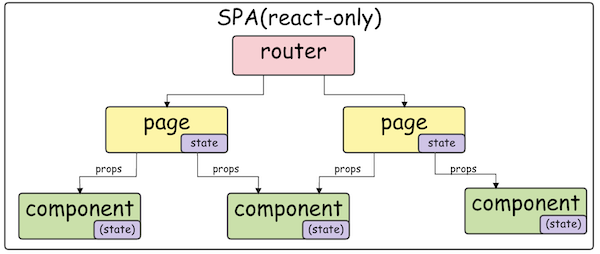
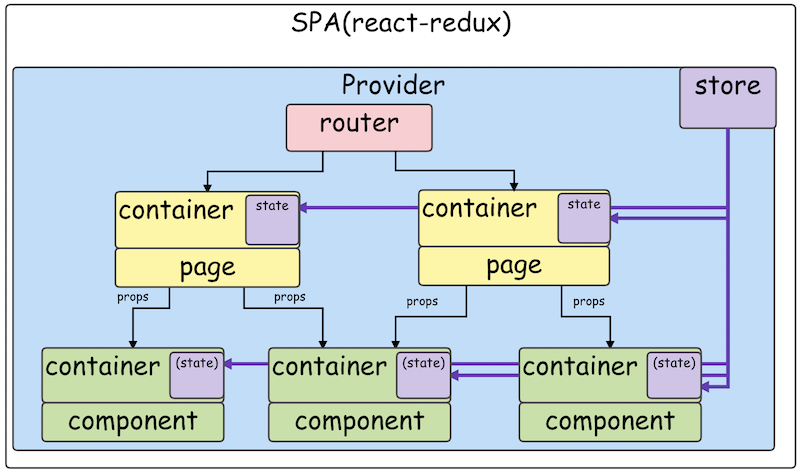

# 12. web開発とredux

- *Up: [目次](../index.md)*
- *Back: [11. middleware - hooks](./11_middleware.md)*
- *Next: [13. booksアプリ](./13_books_app.md)*

## 説明

実際のweb開発にreduxを適用するときの考え方を説明する。

## SPA(React-only)

小規模なwebアプリでは、Reactで完結する場合もある。

router - page - component

routerは複数のpageからなる。

pageは複数のcomponentからなる。

pageはcomponentにpropsを渡すことができる。

routerは[History API](https://developer.mozilla.org/en-US/docs/Web/API/History_API)に依存する。

page、componentは純関数。

## SPA(React-redux)

大規模なwebアプリでは、reduxを用いた構成になる。

Provider(router - page - component)

Providerはcontextパターンの一つで、reduxを知っている。

### ロジックと見た目の分離

状態遷移のロジックを「知っている部分」と「知らない部分」を分離するアプローチが必要。

- pageのロジック部分をpage containerとpage presenterに分離する。
- (and/or) componentのロジック部分をcomponent containerとcomponent presenterに分離する。

### redux reducer と react reducer

React 16.8 から useReducer hooks が導入されて、Reactでもreducerを使えるようになった。

redux reducer と react reducer の同じ点と違う点について述べる。

（reduxやhooksのルールを守っていれば、細かいルールはチームによって異なる場合がある）

- 同じ点
  - 純関数なのでテストが簡単
  - 状態遷移のロジックを知っている
- 違う点
  - redux reducer は global state に関心がある
    - 複数ページで共有するデータが矛盾していないか？
    - 逆に「reduxに個別のコンポーネントの細かい状態遷移を記録して延々とpropsを渡す」は良くない
  - react reducer は local state に関心がある
    - 個別のcomponentの動きが矛盾していないか？
    - 逆に「routerにuseReducerを置いて延々とpropsを渡す」は良くない
