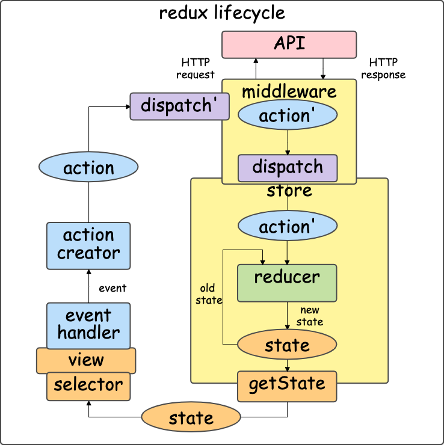

# middleware

- *Back: [非同期処理](./12_async.md)*
- *Next: [非同期処理演習](./14_async_exercise.md)*

## 定義

`middleware`は、`dispatch`を受け取って別の`dispatch`を返す関数である。

## 役割

`middleware`は`store.dispatch`に仕事を追加する。

本来の`store.dispatch`は、`action`を1回実行した時点で完了し、そのままreduxライフサイクルが進む。

`store`に`middleware`を追加すると`store.dispatch`の性質が変化する。

外部サービスと通信したり、複数の`action`を連鎖的に実行したり、実行を遅らせたりすることができる。

