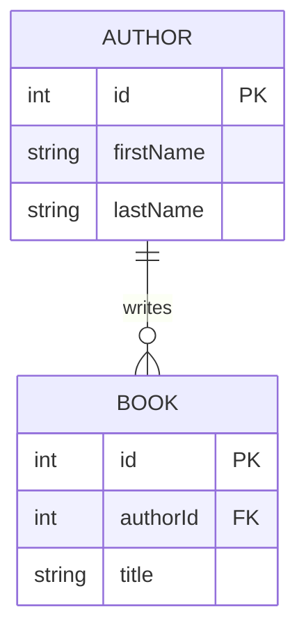

# 14. booksアプリ

- *Up: [目次](../index.md)*
- *Back: [13. web開発とredux](./13_web_app_development.md)*
- *Next: [15. booksアプリ - 作家一覧](./15_books_app_author_table.md)*

## 概要

複数ページを持つwebアプリのルールを考えるため、本を管理するアプリを用いて実習を行う。

## ソース

[booksアプリ](https://codesandbox.io/s/books-m7xgxj)

## ファイルレイアウト

- src/
  - components/ - Reactコンポーネント
  - index.tsx - webアプリのroot
  - models/ - リソース(作家/本)の型
  - pages/ - ページ
  - slices/ - slice
  - app/
    - store.ts - store

## ER図

- `author`: 作家
- `book`: 本

`author` `1`: `book` `0-n` の親子関係がある。

## 画面イメージ

以下のような関係でコンポーネントを組み合わせている。

- pages/AuthorsPage - 作家(author)一覧・追加画面
  - components/Header - ヘッダー
  - components/AuthorsTable - 作家一覧
  - components/AuthorCreateForm - 作家追加フォーム
- pages/BooksPage - 本(book)一覧・追加画面
  - components/Header - ヘッダー
  - components/BooksTable - 本一覧
  - components/BookCreateForm - 本追加フォーム

### 作家(author)一覧・追加画面

### 本(book)一覧・追加画面

