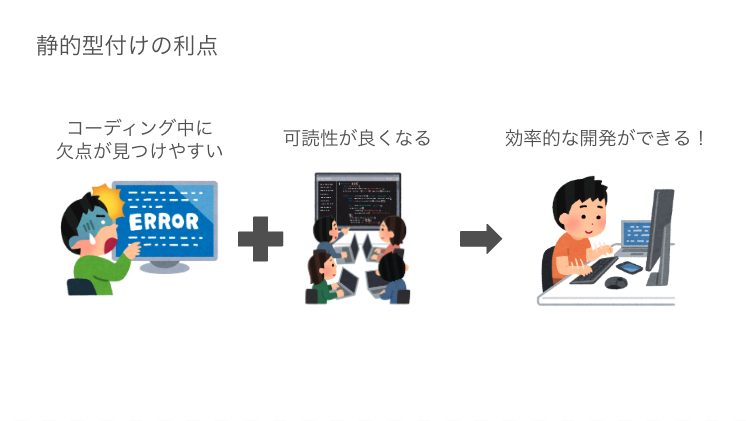
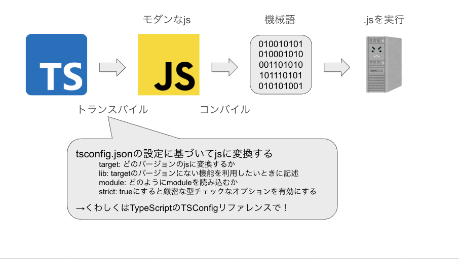

# TypeScript について知る

## 目次

- [TypeScript とは何か](#TypeScript-とは何か)
- [トランスパイラ](#トランスパイラ)
- [TypeScript と JavaScript の学習](#TypeScript-と-JavaScript-の学習)
- [演習関連](#演習関連)

## TypeScript とは何か

- Microsoft が開発した静的型付け言語
  - 静的型付け
    - 変数や関数に入ってくる値について、コンパイルやプログラムの実行よりも前に型があらかじめ決められている形態のこと
      
  - 動的型付け
    - 変数や関数に入ってくる値について、コンパイルやプログラムの実行よりも前に型を決めずに実行時に型の決定が行われる形態のこと
    - JavaScript は動的型付け言語
  - JavaScript のスーパーセット
- 簡単に言うと JavaScript に型を付けた言語
  - TypeScript から型情報を取り除くと JavaScript となる
- 基本的な JavaScript 構文が使える
  - 厳密には `tsconfig.json` の `lib` に指定した EcmaScript の Edition 毎でサポートされた構文
- [TC39](https://tc39.es/) の [stage3](https://github.com/tc39/proposals/blob/HEAD/README.md) などの機能も JavaScript に先行して使えたりするものもある
- 拡張子は `.ts`

<details><summary>Advanced</summary>

`tsconfig.json` の覚えとくと捗る `compilerOptions`

- `target`
  トランスパイルおよび polyfill の対象を指定する項目
  `tsc` でトランスパイルした場合に、ここに指定した ES edition に準拠する JavaScript が吐き出される
- `lib`
  TypeScript を記述する際に利用できる機能を列挙する項目
  最新の ES edition の機能を使いたい場合は、 `esnext` を追加する
  また、ブラウザで動かすことを想定するのであれば、 `dom` を指定する
- `module`
  トランスパイル時の JavaScript モジュールパターンを指定する項目
- `strict`
  `true` に設定すると、厳密な型チェックのオプションを `true` にする
  TypeScript の恩恵を受けるのであれば `true` 必至
  プロジェクト初期で TypeScript を導入するのであれば、 `true` 推奨

</details>

```ts
function sum(num1: number, num2: number): number {
  return num1 + num2;
}

sum(1, 2); // OK
sum("1", 2); // コンパイルエラー (Argument of type 'string' is not assignable to parameter of type 'number'.)
```

- 定義した型と異なる値を指定した場合コンパイルエラーになってくれる
  - エディタなどで構文チェックしてくれる場合も、同コンパイラの設定でエラーを吐いてくれる
  - 未然にバグを防げる

## トランスパイラ

<section style="text-align: center;">
  
</section>

- TypeScript は JavaScript にコンパイルしてから実行をする必要がある
  - コンパイル: ある言語で記述されたソースコードを取得し、他の言語で（または多数の）出力ファイルを生成するプログラムを説明する包括的な用語
  - トランスパイル: ソースコードファイルを取り込み、それを他の言語または異なるバージョンの別のソースコードファイルに変換するコンパイラのサブセット( 今回の場合は TypeScript -> JavaScript のイメージ)
  - Web ブラウザ上で動作させるために必要
    - WebAssembly に関しては研修では触れません
  - ブラウザによってサポート出来ている ES バージョンは異なる
    - IE のようなゾンビブラウザでは、古い EcmaScript の構文しかサポートしていないため、IE での動作も保証する場合には必要だったりする
  - tsc, webpack(ts-loader), vite, babel などがある
- 本研修ではトランスパイラに `tsc` を使用していきます

<details><summary>Advanced</summary>

- tsc
  - Microsoft 純正の TypeScript トランスパイラ
  - 最新バージョンの TypeScript に対応したり、言語すべての機能を利用することができる
  - es2015 以前の ES への互換性は低い
  - `--noEmit` option で型チェックのみを行うことも可能
- webpack
  - ts-loader を使い TypeScript をトランスパイル可能
  - 言語全ての機能を利用することができる
  - 多少パフォーマンスが低い
    - Turbopack に期待が集まる
- vite
  - TypeScript をトランスパイル可能
  - 言語全ての機能を利用することができる
  - パフォーマンスが高い
    - ビルド構造に ES module を用いている
- babel
  - モダン JavaScript をコンパイルするためのコンパイラ
  - typeScript のトランスパイルには `@babel/preset-typescript` が必要
  - TypeScript の一部機能が制限される
  - 旧 ES への変換が優秀
    - IE にどうしても対応するなど

</details>

## TypeScript と JavaScript の学習

TypeScript の学習と JavaScript の学習はほぼ同義です。

冒頭で説明したように、 TypeScript は JavaScript のスーパーセットです。
単に型を付与したものです。

TypeScript で配列をソートしたい場合はどうしたら良い？という考えは無く、それは JavaScript で配列をソートする記述と同じです。

例外として、 TypeScript の記法、独自の機能や JavaScript には適用されていない EcmaScript の機能などは別途 TypeScript のバージョンに合わせて学習していく必要はあります。
本研修では、その点の補足をしつつ、 **TypeScript ベースで JavaScript の学習を行う**と考えてください。

Deep Dive に関しては、午後に時間が許す範囲で行います。

## 演習関連

### 準備

リポジトリの `/typescript` ディレクトリに移動し、 TypeScript の開発環境を用意し、実際に TypeScript を書いてみましょう。

```shell
# /typescript ディレクトリへ移動
$ cd typescript
# パッケージをインストール
$ npm i
```

演習問題は、 `/typescript/src/standard` にあります。
`exercise1` から順番に問いていってみてください。

### 動作確認方法

TypeScript を JavaScript にトランスパイルし、トランスパイルされた JavaScript を実行して動作確認を行います。

```shell
# トランスパイル
$ npm run build  # tsc 実行
# node で実行
$ node ./dist/standard/{対象の.jsファイル名} # 相対パスで指定
```

次 [JavaScript(TypeScript) 基礎](./js-basic.md)
