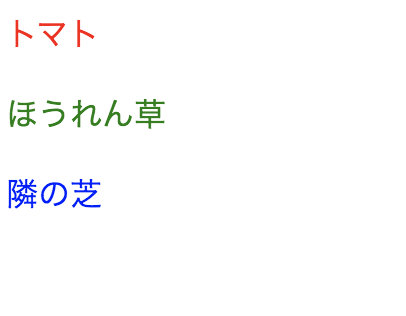

React プログラミングでは、以下のような変数宣言ができます。

```typescript
const element = <h1>Hello, world!</h1>;
```

ECMAScript では、上記のような構文は定義されていません。
上記の `<h1></h1>` は、文字列や HTML でもありません。

**TSX** と呼ばれる TypeScript の拡張構文です。ただし、これはそのままブラウザ上では動作しないので注意が必要です。React の toolchain を使って、TSX を使わない、通常の JavaScript へ変換します。

# コンポーネント（→ ３章）

通常の HTML/CSS/JavaScript の Web アプリケーション開発では、マークアップとロジックを別々のファイルに
書いて人為的に技術を分離します。一方、React は、マークアップとロジックの両方を含む疎結合の
「 **コンポーネント** 」という単位を導入して、関心を分離します。

通常の HTML タグ以外に、React プログラマが定義したコンポーネントを TSX に記載することができます。
React は、この疎結合のコンポーネントを導入することで、宣言的なプログラミングを実現します。これについては３章で学びます。

### 通常の HTML タグで書く TSX

```typescript
const element = <h1>Hello, world!</h1>;
```

### コンポーネントで書く TSX

```typescript
interface Props {
  name: string;
}
function Hello({ name }: Props) {
  return <h1>Hello, {name}</h1>;
}

const element = <Hello name="world!" />;
```

<details><summary>Advanced</summary>

もし TSX の助けを得ずに記述すると、このようになります。

```typescript
import React from 'react';

const element = React.createElement('h1', null, 'Hello, world!');
```

```typescript
import React from 'react';

interface Props {
  name: string;
}
function Hello({ name }: Props) {
  return React.createElement('h1', null, `Hello, ${name}`);
}

const element = React.createElement(Hello, { name: 'world!' });
```

</details>

# TSX に式を埋め込む

TSX 内で **中括弧 {}** で囲むことで、TypeScript の式を使用できます。

```typescript
const name = 'Seiji';
const element = <h1>Hello, {name}</h1>;

ReactDOM.createRoot(document.body).render(element);
```

たとえば、`formatName(user)` という TypeScript 関数の結果を入れることもできます。

```typescript
interface User {
  firstName: string;
  lastName: string;
}
function formatName(user: User) {
  return `${user.firstName} ${user.lastName}`;
}

const user = {
  firstName: 'Seiji',
  lastName: 'Urushihara',
};

const element = <h1>Hello, {formatName(user)}</h1>;

ReactDOM.createRoot(document.body).render(element);
```

TSX の構文を複数行に分けて記述する場合は、括弧`()` で囲んでください。

```typescript
const element = <h1>Hello, {formatName(user)}</h1>;
```

<details><summary>Advanced</summary>

もし TSX の助けを得ずに記述すると、このようになります。

```typescript
import React from 'react';

const element = React.createElement('h1', null, 'Hello, ', formatName(user));
```

</details>

# TSX も式である

変数への代入はもちろん、

- 関数の引数への受け渡し
- 関数からの戻り値
- `if`文や`for`文の中

などで TSX を利用できます。

```typescript
function getGreeting(user) {
  if (user) {
    return <h1>Hello, {formatName(user)}!</h1>;
  }
  return <h1>Hello, guest.</h1>;
}
```

<details><summary>Advanced</summary>

もし TSX の助けを得ずに記述すると、このようになります。

```typescript
import React from "react"

function getGreeting(user) {
  if (user) {
    return React.createElement("h1",null,
      "Hello, ", formatName(user)
    )
  }
  return React.createElement("h1",null,
    "Hello, guest."
  )
```

</details>

# TSX に属性を指定する

## 文字列リテラル

文字列リテラルを属性として指定するために引用符`""`を使用できます。

```typescript
const element = <div tabIndex="0"></div>;
```

## TypeScript 式を埋め込む

TypeScript 式を TSX に埋め込むために中括弧`{}`を使用します。

```typescript
const element = <div tabIndex={getIndex()}></div>;
```

<details><summary>Advanced</summary>

もし TSX の助けを得ずに記述すると、このようになります。

```typescript
import React from 'react';

const element = React.createElement('div', { tabIndex: '0' });
const element = React.createElement('div', { tabIndex: getIndex() });
```

</details>

## スプレッド演算子を利用した属性の展開

コンポーネントに渡すオブジェクトをスプレッド演算子として使用することで、
オブジェクトのパラメータを属性として展開できます。

下記の例は、等価です。

```typescript
function App1() {
  return <Greeting firstName="Seiji" lastName="Urushihara" />;
}

function App2() {
  const props = { firstName: 'Seiji', lastName: 'Urushihara' };
  return <Greeting {...props} />;
}
```

<details><summary>Advanced</summary>

もし TSX の助けを得ずに記述すると、このようになります。

```typescript
import React from 'react';

function App1() {
  return React.createElement(Greeting, { firstName: 'Seiji', lastName: 'Urushihara' });
}

function App2() {
  const props = { firstName: 'Seiji', lastName: 'Urushihara' };
  return React.createElement(Greeting, { ...props });
}
```

</details>

## すべての HTML 属性をサポート

React は、すべての HTML 属性をサポートしています。

```
accept acceptCharset accessKey action allowFullScreen alt async autoComplete
autoFocus autoPlay capture cellPadding cellSpacing challenge charSet checked
cite classID className colSpan cols content contentEditable contextMenu controls
controlsList coords crossOrigin data dateTime default defer dir disabled
download draggable encType form formAction formEncType formMethod formNoValidate
formTarget frameBorder headers height hidden high href hrefLang htmlFor
httpEquiv icon id inputMode integrity is keyParams keyType kind label lang list
loop low manifest marginHeight marginWidth max maxLength media mediaGroup method
min minLength multiple muted name noValidate nonce open optimum pattern
placeholder poster preload profile radioGroup readOnly rel required reversed
role rowSpan rows sandbox scope scoped scrolling seamless selected shape size
sizes span spellCheck src srcDoc srcLang srcSet start step style summary
tabIndex target title type useMap value width wmode wrap
```

改めて、忘れてはいけない点は、HTML ではなく、「TSX は TypeScript の拡張構文」であるということです。

**TSX の属性は、キャメルケース（camelCase）の命名規則** を使用する必要があります。

TypeScript の予約語と被る属性、例えば、

- `class` は、`className`
- `for` は、`htmlFor`

と記述します。

例外として、`aria-*`属性と`data-*`属性は、キャメルケースの命名規則を利用しなくてよいです。

# TSX で子要素を指定する

TSX のタグは子要素を持つことができます。

```typescript
const element = (
  <div>
    <h1>Hello!</h1>
    <h2>Good to see you here.</h2>
  </div>
);
```

# 空の要素

TSX は、空要素を表現することができます。上記のような構造を表現するとき、余分な div を使わずに済ませることができます。

```typescript
const element = (
  <>
    <h1>Hello!</h1>
    <h2>Good to see you here.</h2>
  </>
);
```

# TSX (JSX) を深く理解する

https://ja.reactjs.org/docs/jsx-in-depth.html

# 【課題 1-1】スタイルを指定してみよう！

以下の要件を満たしてください。

- 任意の赤色の物の名前, 緑色の物の名前, 青色の物の名前を TSX 内に追加
  - それぞれが赤色, 青色, 緑色となるようにスタイルを指定
  - 並びや位置関係、厳密に物の色が正しいかどうかは不問

```bash
# react/exercise にて
$ TARGET=C1/Q1 npm run dev
```


