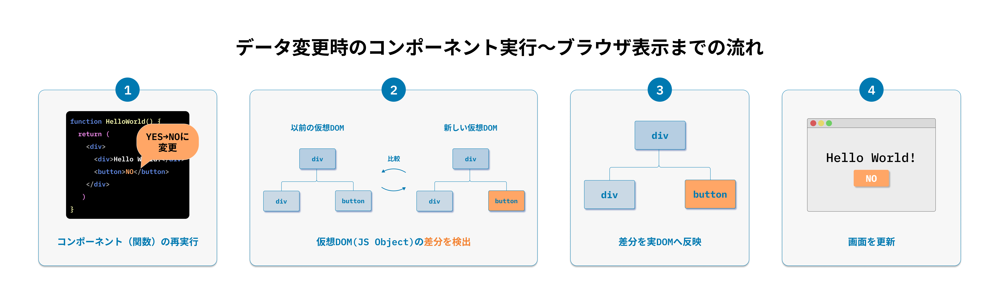

# React 要素をルート DOM にレンダリングする

React 要素は、JavaScript の関数です。ただの関数であるため、ブラウザの DOM に描画するための API を利用する必要があります。ブラウザの DOM に描画するには、react-dom ライブラリが提供する `ReactDOM.createRoot().render()` を利用します。

HTML ファイルにマークアップされた `id`属性の値が`root`の`div`要素に対して、「Hello, world!」を描画する例は以下の通りです。

```html
<div id="root"></div>
```

```javascript
ReactDOM.createRoot(document.getElementById("root")!).render(<h1>Hello, world!</h1>);
```

# 【課題 2-1】 自分の氏名を表示してみよう！

以下の要件を満たしてください。

- 画面に「Hello, FirstName LastName!」を出力する
  - （注: FirstName LastName は各自の名前）
- `ReactDOM.createRoot` の仮引数に対象の container を渡します
- `render` に氏名を格納した DOM を渡します

```bash
# react/exercise にて
$ TARGET=C02/Q1 npm run dev
```

編集対象ファイル: `react/exercise/C02/Q1/index.tsx`

# React は仮想 DOM により再描画が必要な箇所のみ更新する

DOM API を使って実装した場合、開発者自身が値の変更箇所を検知する仕組みを用意し、
描画の更新を明示的にプログラミングしていく必要があります。

React では、明示的に要素の更新箇所を制御する必要はありません。仮想 DOM によって再描画が必要な箇所は、
React が面倒を見ます。結果、DOM API を扱うよりもパフォーマンスに優れた実装が可能となります。
もちろん、例外はありますが、多くのケースでは気にする必要はありません。

## 仮想 DOM について

仮想 DOM はリアル DOM をメモリ内に表現したものです。UI の表現はメモリ内に保持され、リアル DOM と同期されます。

基礎となるデータが変更されるたびに、UI 全体が 仮想 DOM で再レンダリングされます。


そして、以前の DOM と新しい DOM の差分を算出します。


計算が終わると、Real DOM は実際に変更されたものだけが更新されます。



## 「秒刻みで動く時計」のサンプルで確認してみよう

「秒刻みで動く時計」のサンプルで、再描画が必要な箇所のみ更新されていることを確認します。

```javascript
import { createRoot } from 'react-dom/client';

function tick() {
  const element = (
    <div>
      <h1>Hello, world!</h1>
      <h2>It is {new Date().toLocaleTimeString()}.</h2>
    </div>
  );
  createRoot(document.body).render(element);
}

setInterval(tick, 1000);
```

```bash
# react/exercise にて
$ TARGET=C02/Time npm run dev
```

<details><summary>Advanced</summary>

もしも React に頼らず vanillajs で記述すると、このようになります。

```javascript
function tick() {
  const h1_text = 'Hello, world!';
  const h2_text = `It is ${new Date().toLocaleTimeString()}.`;

  const root = document.getElementById('root');
  if (root.children.length === 1) {
    const [div] = root.children;
    if (div.children.length === 2) {
      const [h1, h2] = div.children;
      if (h1.textContent !== h1_text) {
        h1.textContent = h1_text;
      }
      if (h2.textContent !== h2_text) {
        h2.textContent = h2_text;
      }
    }
  } else {
    const div = document.createElement('div');

    const h1 = document.createElement('h1');
    h1.textContent = h1_text;

    const h2 = document.createElement('h2');
    h2.textContent = h2_text;

    div.appendChild(h1);
    div.appendChild(h2);

    root.appendChild(div);
  }
}

setInterval(tick, 1000);
```

</details>
