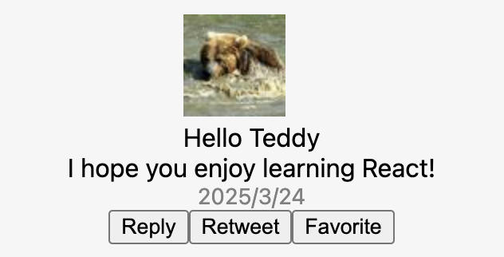

ここでは、「**コンポーネント**」という概念を導入します。

コンポーネントの導入を導入することで、UI を独立した、再利用できる部分に分割し、
パーツそれぞれを分離して考えることができるようになります。

# コンポーネントとは？

「疎結合の再利用できる部品に分割したもの」をコンポーネントと定義します。

単純な例として、下記のような単純な関数は、コンポーネントです。

```typescript
interface Props {
  name: string;
}
function Welcome(props: Props) {
  return <h1>Hello, {props.name}</h1>;
}
```

つまり、React のコンポーネントはただの TypeScript の関数です。
関数仕様は、引数`props` で任意の値を受け取り、画面上に表示したい React 要素を返します。

React では、関数のコンポーネントのことを「**関数コンポーネント（function component）**」と呼びます。

なお、React では、ES6 クラスでもコンポーネントを定義できます。ES6 クラスで定義したコンポーネントのことを
「**クラスコンポーネント（class component）**」と呼びます。

```javascript
import {Component} from React

class Welcom extends Component {
  render() {
    return <h1>Hello, {this.props.name}</h1>
  }
}
```

### 命名規則について

基本的には、JS/TS の慣習に従ってください。開発案件では、コーディングルールがあらかじめ決められているので、
そのルールに従うことになります。

基本的には、下記の命名規則を使うことになります。

- コンポーネント名は、「**upper camel case**」（e.g. CamelCase）
- それ以外の変数名や関数名は、「**lower camel case**」（e.g. camelCase）
- 定数名（固定値）は、「**snake case**」（e.g. SNAKE_CASE）

### 関数コンポーネント vs. クラスコンポーネント

**最新のバージョンの React は、関数コンポーネントを使った実装を推奨しています。**
一部を除き、クラスコンポーネントを使った実装は、極力行わないようにしてください。
後の研修で説明しますが、React Hooks API は関数コンポーネントでの利用を想定した API であるため、
クラスコンポーネントを選択して実装する必要はありません。

React 公式ガイドでは、互換性の観点からクラスコンポーネントを使った説明が多く残されていますが、
これからのフロントエンド開発では、クラスコンポーネントを使う場面は非常に少なくなります。

# props について

コンポーネントの引数のことを、`props`と呼びます。

`props`は、以下の特性を持ちます。

- コンポーネント自身で変更してはならない
- 読み取り専用である
- 親コンポーネントは props を子コンポーネントに渡すことができるが、子コンポーネントは受け取った props を修正することはできない

全てのコンポーネントは、自身の `props` に対して純粋関数のように振舞わなければなりません。
以下の例は、ルールに反するため、React のビルドでエラーになります。

```typescript
interface Props {
  name: string;
}
function Welcom(props: Props) {
  props.name = 'COVID-19'; // NG!!
  return <h1>Hello, {props.name}</h1>;
}
```

# コンポーネントを組み合わせる

コンポーネントという単一の抽象化を利用することで、
コンポーネントは自身の出力（`return`）の中で他のコンポーネントを参照できます。

```typescript
interface Props {
  name: string;
}
function Welcome(props: Props) {
  return <h1>Hello, {props.name}</h1>;
}

function App() {
  return (
    <div>
      <Welcome name="Seiji" />
      <Welcome name="Masashi" />
      <Welcome name="ACCESS" />
    </div>
  );
}

createRoot(document.getElementById('root')!).render(<App />);
```

```bash
# react/exercise にて
$ TARGET=C03/Sample1 npm run dev
```

典型的な React アプリケーションは、上記のような `App` コンポーネントをルートとして、様々なコンポーネントを組み合わせて作られます。

# コンポーネントを分割・抽出する

開発を行なっていると、コンポーネントの構造が大きくなることがあります。そうなった場合、
コンポーネントの分割・抽出を考えることになります。

## 分割・抽出前

コンポーネントを分割・抽出について、下記の `Comment` コンポーネントを例に考えてみます。

```typescript
function formatDate(date: Date) {
  return date.toLocaleDateString();
}

interface Props {
  date: Date;
  text: string;
  author: {
    name: string;
    avatarUrl: string;
  };
}

function Comment(props: Props) {
  return (
    <div className="comment">
      <div className="userInfo">
        
        <div className="userInfo-name">{props.author.name}</div>
      </div>
      <div className="comment-text">{props.text}</div>
      <div className="comment-date">{formatDate(props.date)}</div>
    </div>
  );
}

const comment = {
  date: new Date(),
  text: 'I hope you enjoy learning React!',
  author: {
    name: 'Hello Kitty',
    avatarUrl: 'https://placekitten.com/g/64/64',
  },
};

createRoot(document.getElementById('root')!).render(
  <Comment date={comment.date} text={comment.text} author={comment.author} />
);
```

```bash
# react/exercise にて
$ TARGET=C03/Sample2 npm run dev
```

どのように抽出・分割していくかは、コンポーネントの抽象度をどうするかは、アプリの構造に依存します。

抽出・分割したコンポーネントが、再利用できるのであれば、積極的にコンポーネント化を進めてください。

## 分割・抽出後

`Avatar`コンポーネントと`UserInfo`コンポーネントの 2 つのコンポーネントに分割・抽出しています。

```typescript
interface User {
  name: string;
  avatarUrl: string;
}

function Avatar(props: User) {
  return ;
}
```

```typescript
function UserInfo(props: User) {
  return (
    <div className="UserInfo">
      <Avatar avatarUrl={props.avatarUrl} name={props.name} />
      <div className="UserInfo-name">{props.name}</div>
    </div>
  );
}
```

```typescript
interface Props {
  date: Date;
  text: string;
  author: User;
}
function Comment(props: Props) {
  return (
    <div className="Comment">
      <UserInfo avatarUrl={props.author.avatarUrl} name={props.author.name} />
      <div className="Comment-text">{props.text}</div>
      <div className="Comment-date">{formatDate(props.date)}</div>
    </div>
  );
}
```

分割・抽出後の全体のコードは下記の通りです。

```javascript

function formatDate(date: Date) {
  return date.toLocaleDateString();
}

interface User {
  name: string;
  avatarUrl: string;
}

function Avatar(props: User) {
  return ;
}

function UserInfo(props: User) {
  return (
    <div className="UserInfo">
      <Avatar avatarUrl={props.avatarUrl} name={props.name} />
      <div className="UserInfo-name">{props.name}</div>
    </div>
  );
}

interface Props {
  date: Date;
  text: string;
  author: User;
}

function Comment(props: Props) {
  return (
    <div className="Comment">
      <UserInfo avatarUrl={props.author.avatarUrl} name={props.author.name} />
      <div className="Comment-text">{props.text}</div>
      <div className="Comment-date">{formatDate(props.date)}</div>
    </div>
  );
}

const comment = {
  date: new Date(),
  text: "I hope you enjoy learning React!",
  author: {
    name: "Hello Kitty",
    avatarUrl: "https://placekitten.com/g/64/64",
  },
};

createRoot(document.getElementById("root")!).render(
  <Comment date={comment.date} text={comment.text} author={comment.author} />
);
```

```bash
# react/exercise にて
$ TARGET=C03/Sample3 npm run dev
```

`Comment`コンポーネントがシンプルになりました。

労力を伴う作業であるが、アプリが大きくなったときに努力に見合った利益を生み出します。

# 【ヒント】コンポーネントの分け方

コンポーネントの分け方は、Atomic Design の考え方が参考になるでしょう。

多くの開発案件で、Atomic Design が採用されています。

https://bradfrost.com/blog/post/atomic-web-design/

# 【課題 3-1】Reply,Retweet,Favorite ボタンを追加してみよう！

前の実装例に、「Reply」「Retweet」「Favorite」の UI を追加してください。

その際、以下の要件を満たしてください。

- 「Reply」「Retweet」「Favorite」のラベル（名前）を受け取る、再利用可能なコンポーネントを一つ追加する
- 「Reply」「Retweet」「Favorite」それぞれを配置する

なお、現段階では以下の要件を満たす必要はありません。

- 「Reply」「Retweet」「Favorite」を選択したときのイベント実装
- デザイン性（要件を満たしていれば OK とします）

下図は、期待する表示のイメージ（解答例）です。



```bash
# react/exercise にて
$ TARGET=C03/Q1 npm run dev
```

編集対象ファイル: `react/exercise/C03/Q1/index.tsx`
