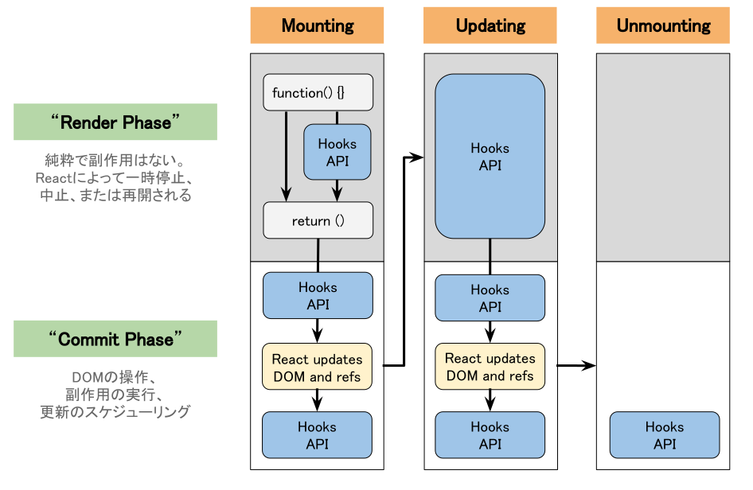

ここでは、Reactコンポーネントにおけるライフサイクル（状態遷移）についての導入を行います。Reactの挙動を把握する上でライフサイクルは重要なポイントです。
// 口頭でも良いので、ライフサイクルのなにが重要なのかやなぜ重要なのかを説明しておいた方がよいと思いました。
// 個人的には、各Hooksの実行のタイミングとレンダリングとマウンティングの違いを知ることとが重要なのかなと思ってます。

# 状態

|状態 | 説明  |
|:--|:--|
|Mounting（マウント）| コンポーネントがDOMとして描画されるとき |
|Unmounting（アンマウント） | コンポーネントが生成したDOMが削除されるとき |
|Updating（再描画） | DOMの内容を更新するとき |
|Render Phase | 純粋で副作用を伴わない処理。仮想DOM（VirtualDOM）と呼ばれる世界 |
// 「仮想DOM（VirtualDOM）と呼ばれる世界」だと意味が伝わりにくいので、いい感じに言い換えたいです。
|Commit Phase | DOM操作を含めた、副作用の実行。react-dom ライブラリの仕事 |

// 描画と書かれていますが、ブラウザが画面を描画する「ブラウザレンダリング」とは別なので、公式Docのように「コミット」という単語を使いたいです。

# Hooks API

Hooks API は、 **React v16.8** から導入された新機能で、
Reactの機能に「接続（hook into）」するための特別な関数です。
ES6クラスを書かずに実装できるのが、特徴です。

詳細については、後の章で説明します。

| API | 説明 |
|:-- |:-- |
| `useState` | コンポーネントの状態保存と再描画のスケジューリング |
| `useEffect` | 副作用の実行 |
// 「副作用の実行」は誤解を与えるため、避けたいです。useEffect以外でも副作用は実行されます。React公式Docには、「useEffect は、コンポーネントを外部システムと同期させるための React フックです。」と書かれおり、「外部システムとの同期」としたいです。
| `useReducer` | `useState`の代替API。複数の状態管理に適する |
| `useCallback` | 関数オブジェクトのメモ化を行う |
| `useMemo` | 計算処理に時間がかかるケースで値のメモ化を行う |
| `useContext` | 親コンポーネントの状態を `props` を経由しないで引き渡す API |
| `useLayoutEffect` | ブラウザによって描画される前のタイミングで同期的に呼び出される関数 |
| `useRef` | コンポーネント内のDOM要素の参照を取得する |
// 「コンポーネント内のDOM要素の参照を取得する」は誤解を与えるため避けたいです。React公式Docには、「useRef は、レンダー時には不要な値を参照するための React フックです。」と書かれており、「レンダー時には不要な値を参照する」としたいです。
| `useImperativeHandle` | **親** コンポーネント内のDOM要素の参照を取得する |
| `useDebugValue` | React DevTools でカスタムフックのラベルを表示する |
// useSyncExternalStoreやuseTransitionなど、React18,19で追加されたHooksを追加するか考えたいです。個人的には、初学者をターゲットとしているので追加しなくても良いかなと思いました。追加しないのであれば、使用頻度が低いuseImperativeHandleとuseDebugValueは削除して良いのかなと思いました。

利用頻度の高いAPIは、`useState`、`useEffect`、`useReducer`、`useCallback`です。
このAPIの使い方を覚えれば、大抵のアプリ実装が可能です。詳細は、次章以降で説明します。