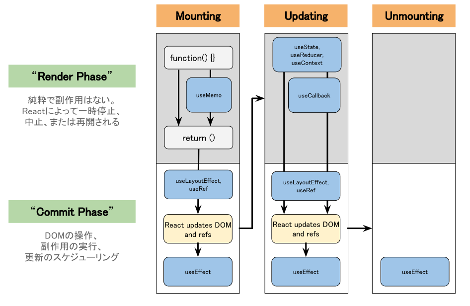

ここでは、Reactコンポーネントにおけるライフサイクル（状態遷移）についての導入を行います。Reactの挙動を把握する上でライフサイクルは重要なポイントです。

「第2章　要素のレンダー」で掲載した図を再掲します。
「①関数の実行」がレンダーフェーズにあたり、「②実DOMへの反映」はコミットフェーズで行います。

# 状態

|状態 | 説明  |
|:--|:--|
|Mounting（マウント）| コンポーネントがDOMとして描画されるとき |
|Unmounting（アンマウント） | コンポーネントが生成したDOMが削除されるとき |
|Updating（更新） | DOMの内容を更新するとき |
|Render Phase | 関数を実行し仮想DOMを構築する。副作用は実行されない。 |
|Commit Phase | 仮想DOMで計算された差分を実DOMに反映する。副作用を実行する。 |

# Hooks API

Hooks API は、 **React v16.8** から導入された新機能で、
Reactの機能に「接続（hook into）」するための特別な関数です。
ES6クラスを書かずに実装できるのが、特徴です。

詳細については、後の章で説明します。

| API | 説明 |
|:-- |:-- |
| `useState` | コンポーネントの状態保存と再描画のスケジューリング |
| `useEffect` | 外部システムとの同期 |
| `useReducer` | `useState`の代替API。複数の状態管理に適する |
| `useCallback` | 関数オブジェクトのメモ化を行う |
| `useMemo` | 計算処理に時間がかかるケースで値のメモ化を行う |
| `useContext` | 親コンポーネントの状態を `props` を経由しないで引き渡す API |
| `useLayoutEffect` | ブラウザによって描画される前のタイミングで同期的に呼び出される関数 |
| `useRef` | レンダー時には不要な値を参照する |

ここで紹介したもの以外にもさまざまなHooksが用意されており、React 19では全部で17個存在します。
利用頻度の高いAPIは、`useState`、`useEffect`、`useReducer`、`useCallback`です。
これらのAPIの使い方を覚えれば、大抵のアプリ実装が可能です。詳細は、次章以降で説明します。
