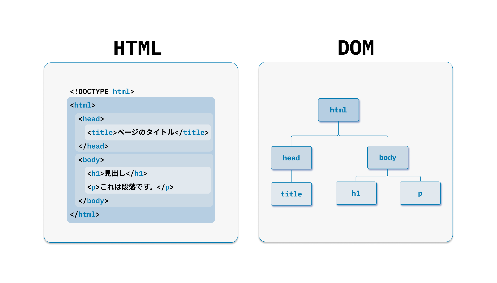

ここでは、 React コンポーネントにおけるライフサイクル（状態遷移）を導入します。
React の挙動を把握する上でライフサイクルは重要なポイントです。

第2章で掲載した図を再掲します。
「①関数の実行」がレンダーフェーズにあたり、「②実DOMへの反映」はコミットフェーズで行います。

# 状態

|状態 | 説明 |
|:--|:--|
|Mounting（マウント）| コンポーネントが初めて DOM に追加されるとき |
|Updating（更新） | DOM の内容を更新するとき |
|Unmounting（アンマウント） | コンポーネントが DOM から削除されるとき |
|Render Phase | 関数を実行し仮想 DOM を構築する。副作用は実行されない。 |
|Commit Phase | 仮想 DOM で計算された差分を実 DOM に反映する。副作用を実行する。 |

# Hooks API

Hooks API は、 **React v16.8** から導入された新機能で、
React の機能に「接続（hook into）」するための特別な関数です。
ES6 クラスを書かずに実装できるのが、特徴です。

詳細については、後の章で説明しますが、以下に代表的な Hooks API の一覧を上げます。

| API | 説明 |
|:-- |:-- |
| `useState` | コンポーネントの状態保存と再描画のスケジューリング |
| `useEffect` | 外部システムとの同期 |
| `useReducer` | `useState`の代替API。複雑な状態管理に適している |
| `useCallback` | 関数オブジェクトのメモ化を行う |
| `useMemo` | 計算処理に時間がかかる値のメモ化を行う |
| `useContext` | 親コンポーネントの状態を `props` を経由せず受け渡す |
| `useLayoutEffect` | ブラウザによって描画される前に同期的に処理を実行する |
| `useRef` | レンダーに影響しない値を参照するために使う |

ここで紹介したもの以外にもさまざまな Hooks が用意されており、 React 19 では全部で17個存在します。
なかでも利用頻度の高い API は、 `useState`、`useEffect`、`useReducer`、`useCallback` の4つです。
これらを使いこなせば、大抵のアプリを実装できます。

各 API の詳細は、次章以降で説明します。
