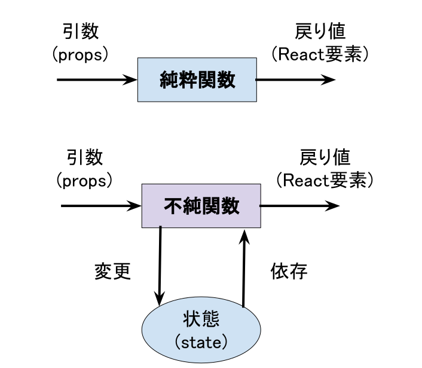
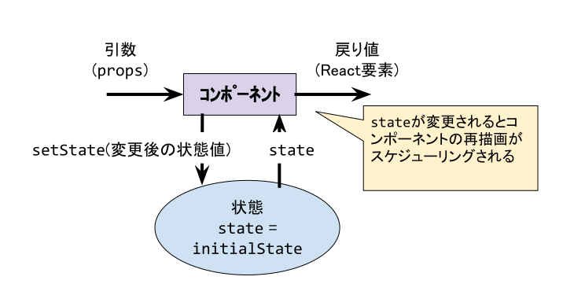

開発を進めていると、コンポーネント自身に状態を持たせたい状況が発生します。
React では、「状態」のことを言葉通りに「state」と呼びます。

# state を持つとは？

`props`は、コンポーネントの外から渡すもので、かつ、読み取り専用です。
一方、`state`は、コンポーネント自身が持つ情報で、かつ、書き換えができます。

関数型言語では、**純粋関数** と **不純関数** という用語があります。
`state` を持つということは、そのコンポーネントは、不純関数です。
一方、`state`を持たず、副作用がないコンポーネントは、純粋関数です。



| コンポーネント | 特徴                                                                                                                                                                |
| :------------- | :------------------------------------------------------------------------------------------------------------------------------------------------------------------ |
| 純粋関数       | 透過参照である（入力`props`に対して、毎回同じ戻り値が返る）。 ユニットテストが実装しやすい。 純粋関数のコンポーネントを組み合わせて作った UI のコードは読みやすい。 |
| 不純関数       | 透過参照でない（入力`props`に対して、異なる戻り値が返ることがある）。ユニットテストが書きにくくなる。                                                               |

# state に関する Hooks API を学ぶ

state を扱うには、`useState`という API を利用します。

```javascript
// useStateを使う準備
import { useState } from 'react';

// const [状態変数, 状態変更関数] = useState(状態変数の初期値)
const [state, setState] = useState(initialState);
```

後で説明しますが、すべての Hooks API はコンポーネント内で呼び出す必要があります。
また、`if`文や`for`文などから呼び出してはいけません。関数の中のトップレベルから Hooks API の呼び出しが許されています。

`useState`は、「現在の state（変数）」と「state を変更する関数」を返します。
このとき、実装者は、「現在の state」と「state を変更する関数」の名前を自由に決めることができます。`initialState`は初期状態です。型は何で指定できますが、Primitive Type（boolean, number, string）を指定してください。Object 型や Array 型も指定できますが、
その場合は、後章で説明する `useReducer` を使う方がよいでしょう。



# 例: カウントアップ

下記コードは、カウントアップに `useState`を使った例です。

```typescript
import React, { FC, useState } from 'react';
import { createRoot } from 'react-dom';

const Counter: FC = () => {
  const [count, setCount] = useState < number > 0;
  const handleClick = () => setCount(count + 1);

  return (
    <div>
      <p>You clicked {count} times</p>
      <button onClick={handleClick}>Click me</button>
    </div>
  );
};

createRoot(document.getElementById('root')!).render(<Counter />);
```

```bash
# react/exercise にて
$ TARGET=C08/Sample1 npm run dev
```

## 【課題 8-1】increment/decrement ボタンを作る

`Counter`コンポーネントを修正して、以下の要件を満たしてください。

- increment(+)ボタンと decrement(-)ボタンを用意する
- increment(+)ボタンを押下すると、count が 1 上がる
- decrement(-)ボタンを押下すると、count が 1 下がる
- count が 0 のとき、decrement(-)ボタンを disabled（ボタン押下できない状態）にする
  - [ヒント] button 要素に `disabled` 属性（boolean）を付与する

```bash
# react/exercise にて
$ TARGET=C08/Q1 npm run dev
```

# 複数の state を扱う

複数の `state`を扱うこともできます。下記のように複数の Primitive Type の state を
並べていくことで状態を分割管理できます。

```javascript
const [count, setCount] = useState(0);
const [comment, setComment] = useState('');
const [date, setDate] = useState(Date.now());
```


## 【課題 8-2】Counter の偶数判定

課題 8-1 のコードをベースに、以下の要件を満たしてください。

- カウントの値が偶数のとき、「Counter: X」の部分の文字色を赤色に変更する
  - [ヒント] CSS に `.evenNumber { color: red; }` を定義すること
  - [ヒント] スタイルを適用したい要素に `className={evenNumber}` を指定すると文字色が赤色になる
  - [ヒント] 偶数・奇数の判定は、[剰余(%)演算子](https://developer.mozilla.org/ja/docs/Web/JavaScript/Reference/Operators/Arithmetic_Operators#Remainder)を使う
  - [ヒント] `count`が偶数かどうかの状態を持つ `useState` を定義する

## 【課題 8-3】イベントとの紐付け

以下の要件を満たしてください。

- 変数 `power` を State 化する
  - `boolean` 型として 初期値 `false` とする
- `Switch` コンポーネントをクリックした際に power の値が切り替わるようにする
  - `true` -> `false`, `false` -> `true`
  - [ヒント] `Switch` コンポーネントの `props` にある `onClick` にイベントハンドラを渡すと、`Switch` コンポーネントをクリックした時の振る舞いを定義できる。

```bash
# react/exercise にて
$ TARGET=C08/Q3 npm run dev
```
