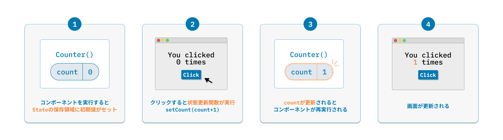
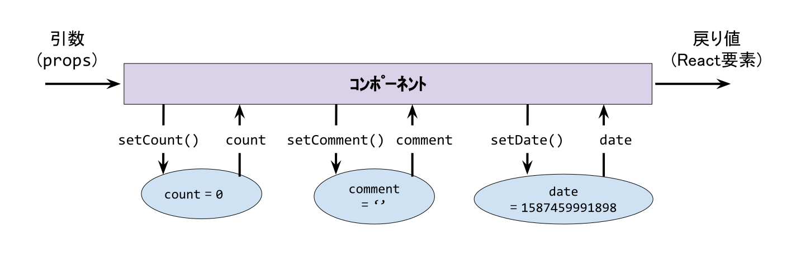

レンダーフェーズは純粋であるというルールを学びました。純粋であるため、propsが同じであれば同じJSXを返します。

そこで気が付くのですが、これでは画面の表示内容を変更することができません。

Reactは画面の表示内容を変更するための機能として、画面表示で変化する値をState（状態）として保持し、Stateを更新することで画面の表示も更新できる仕組みを提供しています。

# useState

State を扱うには、`useState`という API を利用します。

```tsx
// useStateを使う準備
import { useState } from 'react';

// const [現在のstate, 状態更新関数] = useState(状態の初期値)
const [state, setState] = useState(initialState);
```

`useState`は、`initialState`(状態の初期値)を引数として、「現在の state（変数）」と「状態更新関数」を返します。
このとき、実装者は「現在の state」と「状態更新関数」の名前を自由に決めることができますが、[something, setSomething] のように命名する慣習があります。

状態更新関数によって状態が更新されると、コンポーネントが再レンダリングされ、更新後の状態に基づいて画面が描画されます。

# 例: カウントアップ

下記コードは、カウントアップに `useState`を使った例です。

```tsx
import React, { FC, useState } from 'react';
import { createRoot } from 'react-dom';

const Counter: FC = () => {
  const [count, setCount] = useState<number>(0);
  const handleClick = () => setCount(count + 1);

  return (
    <div>
      <p>You clicked {count} times</p>
      <button onClick={handleClick}>Click me</button>
    </div>
  );
};

createRoot(document.getElementById('root')!).render(<Counter />);
```

```bash
# react/exercise にて
$ TARGET=C08/Sample1 npm run dev
```



## 【課題 8-1】increment/decrement ボタンを作る

`Counter`コンポーネントを修正して、以下の要件を満たしてください。

- increment(+)ボタンと decrement(-)ボタンを用意する
- increment(+)ボタンを押下すると、count が 1 上がる
- decrement(-)ボタンを押下すると、count が 1 下がる
- count が 0 のとき、decrement(-)ボタンを disabled（ボタン押下できない状態）にする
  - [ヒント] button 要素に `disabled` 属性（boolean）を付与する

```bash
# react/exercise にて
$ TARGET=C08/Q1 npm run dev
```

編集対象ファイル: `react/exercise/C08/Q1/index.tsx`

# (optional) 状態更新関数に関数を渡す

状態更新関数には、値だけでなく関数を渡すことも可能です。関数を渡す場合、その関数は、純粋で、処理中のstateを引数として受け取り、次のstateを返す必要があります。

例えば、countをincrementする場合、以下のように書けます。

```tsx
const Counter: FC = () => {
  const [count, setCount] = useState<number>(0);
  const handleClick = () =>
    setCount((prevCount) => {
      return prevCount + 1;
    });

  return (
    <div>
      <p>You clicked {count} times</p>
      <button onClick={handleClick}>Click me</button>
    </div>
  );
};
```

状態更新関数に値を渡すか、関数を渡すかは、どちらでもよい場合がほとんどです。

ただし、関数を渡した方がよいケースがあり、 [一連の state の更新をキューに入れる](https://ja.react.dev/learn/queueing-a-series-of-state-updates) と [state の読み取りは次の state を計算するためか？](https://ja.react.dev/learn/removing-effect-dependencies#are-you-reading-some-state-to-calculate-the-next-state) で説明されています。

# 複数の state を扱う

複数の `state`を扱うこともできます。下記のように複数の state を
並べていくことで状態を分割管理できます。

```tsx
const [count, setCount] = useState(0);
const [comment, setComment] = useState('');
const [date, setDate] = useState(Date.now());
```



## 【課題 8-2】Counter の偶数判定

課題 8-1 のコードをベースに、以下の要件を満たしてください。

- カウントの値が偶数のとき、「Counter: X」の部分の文字色を赤色に変更する
  - [ヒント] CSS に `.evenNumber { color: red; }` を定義すること
  - [ヒント] スタイルを適用したい要素に `className={evenNumber}` を指定すると文字色が赤色になる
  - [ヒント] 偶数・奇数の判定は、[剰余(%)演算子](https://developer.mozilla.org/ja/docs/Web/JavaScript/Reference/Operators/Arithmetic_Operators#Remainder)を使う
  - [ヒント] `count`が偶数かどうかの状態を持つ `useState` を定義する

## 【課題 8-3】イベントとの紐付け

以下の要件を満たしてください。

- 変数 `power` を State 化する
  - `boolean` 型として 初期値 `false` とする
- `Switch` コンポーネントをクリックした際に power の値が切り替わるようにする
  - `true` -> `false`, `false` -> `true`
  - [ヒント] `Switch` コンポーネントの `props` にある `onClick` にイベントハンドラを渡すと、`Switch` コンポーネントをクリックした時の振る舞いを定義できる。

```bash
# react/exercise にて
$ TARGET=C08/Q3 npm run dev
```

編集対象ファイル: `react/exercise/C08/Q3/index.tsx`
