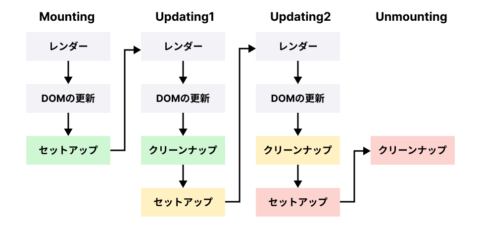

プログラミングおよび React コンポーネントにおける「副作用」とは何なのかについて考えていきます。

# 副作用とは？

プログラミングにおいて、関数の「主たる作用」とは値を返すことであり、副作用とはその主たる作用以外の作用を指します。

React コンポーネントの「主たる作用」は React 要素を返すことです。

では、具体的にはどのような副作用があるのでしょうか？

1. DOM を変更する
2. Web API（HTTP, WebSocket 等）を使った通信
3. グローバル変数の値を書き換える

副作用は、コンポーネントの再利用性が損なわれたり、ユニットテストが書きづらくなるなどの多くのデメリットがあります。とはいえ、Web フロントエンドの世界では副作用にあふれているため、上手に付き合っていかなければなりません。

# 副作用の分類

React で副作用を含むロジックを実装する際、副作用を「ユーザーのアクションがトリガーとなる副作用」と「画面表示がトリガーとなる副作用」の2つに分類すると実装しやすいです。

例えば、提出ボタンを押してサーバーに対してデータを送る動作は「ユーザーのアクションがトリガーとなる副作用」で、画面の初期表示時にサーバーからデータを取得する動作は「画面表示がトリガーとなる副作用」です。

```
NOTE: Reactの公式ドキュメントでは、後者のことを副作用(side effect)と区別するために「エフェクト(Effect)」と名付けています。そのため、本資料もそれに習って「画面表示がトリガーとなる副作用」をエフェクトと呼ぶことにします。
```

「ユーザーのアクションがトリガーとなる副作用」は onClick などのイベントハンドラで実装すれば実現できます。

一方、エフェクトはどのように実装すればよいでしょうか？

単純にコンポーネント内に書いてしまうと、React のコンポーネントのルールである「レンダー中に副作用が起きてはならない」というルールに違反してしまいます。

そこで、エフェクトをコンポーネントに含める場合は、`useEffect` Hooks API を使います。

# useEffect API の導入

- 第1引数：エフェクトのロジックが記述された関数。
- 第2引数：第1引数のコード内で参照される依存値リスト。配列内の値が変更されたときにだけエフェクトの再実行が行われる。

```tsx
useEffect(
  () => {
    // エフェクト処理
  },
  [/* エフェクトの依存値リスト */]
);
```

## 例: document.title を変更する

document.title を変更する実装例です。  
画面に表示されたときに実行したい副作用のため、useEffect を使って実装します。

```tsx
const Counter: FC = () => {
  const [count, setCount] = useState(0);

  useEffect(() => {
    // エフェクト処理
    document.title = `You clicked ${count} times`;

  },[count]); // エフェクトの依存値リスト

  return (
    <>
      <p>You clicked {count} times</p>
      <button onClick={() => setCount(count + 1)}>Click me</button>
    </>
  );
};
```

```bash
# react/exercise にて
$ TARGET=C12/Sample1 npm run dev
```

## エフェクトの実行を抑制したい

エフェクトの実行は、レンダーのたびに毎回ではなく、依存する値が変更したときにだけ再実行されれば十分です。
`useEffect`の第 2 引数（依存リスト）に設定した値が変更されたときにだけ実行されます。

以下のエフェクトは再レンダリングの度に実行されます。

```tsx
useEffect(() => {
  document.title = `You clicked ${count} times`;
});
```

上記のエフェクトを、`count` が変更されたときのみ実行するには下記のように書き換えます。

```tsx
useEffect(() => {
  document.title = `You clicked ${count} times`;
}, [count]);
```

基本的には、Primitive Type を依存リストに含めるような実装としてください。
Object 型、Array 型、Function 型を依存リストに含めるような実装となる場合は、実装が複雑化していると思ってください。

## ESLint: react-hooks/exhaustive-deps ルール

実際の開発の現場では、eslint-plugin-react-hooks パッケージを導入し、さらに、
`"react-hooks/exhaustive-deps": "warn"` を有効にすることをお勧めします。

このルールを適用すると、依存リストの不足などを Linter が警告してくれます。

このルールを破ることは基本的にはありません。つまり、依存値は全て依存配列に入れる必要があり、依存配列に何を設定するかは、Linterの指示のままに自動的に決まります。  
ただし、ルールに従った結果、エフェクトが頻繁に実行されすぎたり、無限ループが発生したりすることがあります。そのような事象例や解決方法は、[公式ドキュメント エフェクトから依存値を取り除く](https://ja.react.dev/learn/removing-effect-dependencies) に書かれているので読んでおくとよいでしょう。

## クリーンナップを必要とするエフェクト

エフェクトにはデータのクリーンナップが必要となることがあります。例えば、以下のような対となる関数が存在したとします。
アプリ実装において、後処理が抜けていた場合、どのような問題が発生するでしょうか？

```
new - delete
create - destroy
add - remove
open - close
connect - disconnect
  :
```

よくある問題は、メモリリーク、アプリケーションの強制終了、予期せぬ不具合などです。
React におけるクリーンナップの実装は、クリーンナップ処理を `useEffect`内に一緒に書くことで、以下のメリットが得られます。

- 実装漏れを防ぐ効果
- 対となる処理をまとめておくことでユニットテストが簡単にかける
- コードリーディングの向上

実装パターンは下記の通りです。

```tsx
useEffect(() => {
  // セットアップ処理
  return () => {
    // クリーンナップ処理
  };
}, [...]);
```

### クリーンナップの実装例

```tsx
useEffect(() => {
  const socket = new WebSocket('ws://localhost:8000')
  const handleMessage(e) {
    console.log(`Message from server ${e.data}`)
  }
  socket.addEventListener('message', handleMessage)

  // クリーンナップ処理の関数を返す
  return () => {
    socket.removeEventListener('message', handleMessage)
    socket.close()
  }
}, [])
```

## useEffectの実行タイミング

以下の図がセットアップとクリーンナップの実行タイミングを表しています。
同じ色のセットアップとクリーンナップが組になっています。  
レンダーフェーズ外でエフェクトを実行していることと、新しいStateでのセットアップの前に古いStateでクリーンナップをしていることがポイントになります。



## 【課題 12-1】Web API（Dummy）から取得したユーザプロファイルを表示する

「条件付きレンダー」と`useEffect`と`useState`の両方を使った課題です。

以下の実装の要件を満たしてください。

- Dummy の Web API を呼び出す `fetchDummyProfile()` を使って、ユーザプロファイルを取得する
- `useEffect` と `useState` を使う
- Dummy の Web API のリクエストは、`UserProfile`コンポーネントの初回レンダーの 1 回のみとする
- Dummy の Web API のリクエスト中は、「Loading...」を画面に表示する
- 読み込み完了後に、ユーザプロファイルを画面に反映する

期待する表示は、下図の通りです。


```bash
# react/exercise にて
$ TARGET=C12/Q1 npm run dev
```

編集対象ファイル: `react/exercise/C12/Q1/index.tsx`

# Suspense

## Suspense の概要

コンポーネントが Mount されても、そのコンポーネントのレンダリングに必要な情報が揃うまで、「ローディング中なのでまだレンダリングできない」という趣旨の画面を表示するべきです。

単純な処理では、元となる情報がない状態でレンダリング処理が成立せず、DOM への反映もできない、ということになってしまいます。

Suspense というコンポーネントは、JavaScript の try-catch 文のようにレンダリングがサスペンドしたコンポーネントを補足して、例外的な画面表示を構築することが機能です。

## Suspense のための例外処理

Suspense されるためのコンポーネントは、準備が整っていない間（ローディング中とか）は、Promise を throw するようにします。
このように、コンポーネントが Promise を throw する、という取扱のことを、サスペンドすると呼びます。

それ以外の、コンポーネントレンダリングに支障がない状態なら、通常通りです。
例えば `Promise` でない例外を発する、通常のコーディングミスは Suspense には捕捉されません。

```tsx
const SampleComponent = () =>{
  // サスペンドする
  throw new Promise();
}
```

注: Suspense を使う開発の際には次に紹介する「 Suspense 対応のデータソース」を使うため、開発者が Promise を throw するコードを書くことはほとんどありません。

## Suspense 対応のデータソース

Suspense コンポーネントを利用するためには、 Suspense に対応したデータソースを利用する必要があります。現時点では、以下のものが挙げられます。

- [Relay](https://relay.dev/docs/guided-tour/rendering/loading-states/) や [Next.js](https://nextjs.org/docs/app/building-your-application/routing/loading-ui-and-streaming#streaming-with-suspense) のようなサスペンス対応のフレームワークデータフェッチ
- [lazy](https://ja.react.dev/reference/react/lazy) を用いたコンポーネントの遅延ロード
- [use](https://ja.react.dev/reference/react/use) を用いたキャッシュ済み Promise からの値の読み取り

<details><summary>コンポーネントの例</summary>

use を用いて、与えられた Promise が解決するまでサスペンドし、解決したらアドレスカードをレンダリングする例

```tsx
import { use } from 'react';

// 注: promiseはコンポーネント内で定義してはいけない。
// https://ja.react.dev/blog/2024/12/05/react-19#use-does-not-support-promises-created-in-render
const promise: Promise<User> = fetchDummyProfile();

const Card = () => {
  const data = use(promise)

  return (
    <div className="card">
      <p>name: {data.name}</p>
      <p>address: {data.address}</p>
    </div>
  );
};
```

</details>

## Suspense で囲む

例で示した Card コンポーネントをレンダリングすると、Promise が解決するまでは何も画面に表示されないはずです。

「ローディング中」のような画面を描画して待ち、Promise 完了で直ちにアドレスカード描画をするためには、`<Suspense>...</Suspense>`で`<Card />`を囲みます。

<details><summary>コンポーネントの例</summary>

Card コンポーネントを囲み、ローディング中は「Loading...」という表記をする例

```tsx
import { type FC, Suspense } from 'react';

const CardPage: FC = () => {
  return (
    <div className="pair">
      <h1>Card Page</h1>
      <Suspense fallback={<p>Loading...</p>}>
        <Card />
      </Suspense>
    </div>
  );
};
```

</details>

例示したコードは、画面表示直後には「Loading...」と描画し、fetchDummyProfile で定義した Promise が解決した直後に Card コンポーネントが再描画されます。

## 【課題 12-2】 (Optional) 課題12-1 を Suspense と use を使って書き換えてみよう

課題12-1を同一の動作のまま Suspense と use を使って書き換えてみましょう。

- Dummy の Web API を呼び出す `fetchDummyProfile()` を使って、ユーザプロファイルを取得する
- `Suspense` と `use` を使う
- `useState` と `useEffect` は使わない
- Dummy の Web API のリクエストは、`UserProfile`コンポーネントの初回レンダーの 1 回のみとする
- Dummy の Web API のリクエスト中は、「Loading...」を画面に表示する
- 読み込み完了後に、ユーザプロファイルを画面に反映する

```bash
# react/exercise にて
$ TARGET=C12/Q2 npm run dev
```

編集対象ファイル: `react/exercise/C12/Q2/index.tsx`
