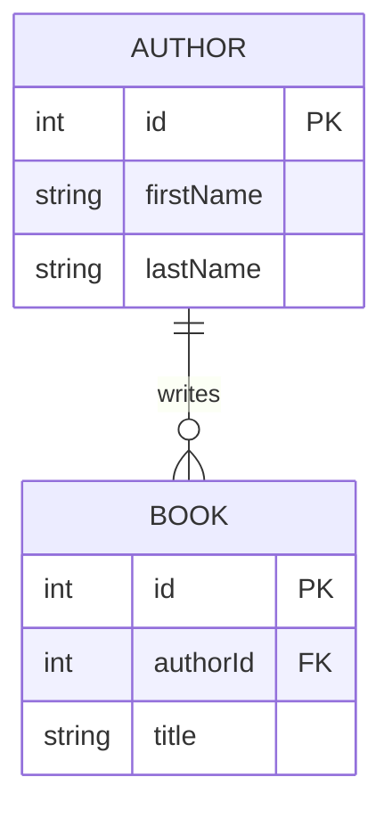

# Redux

Redux演習用のTODOアプリ

## 環境構築

### Redux DevTools

#### 説明

Redux DevToolsは、reduxの動作を可視化するためのChromeの拡張機能です。

#### 手順

[ドキュメント](https://chrome.google.com/webstore/detail/redux-devtools/lmhkpmbekcpmknklioeibfkpmmfibljd?hl=en)に従ってインストールしてください。

### CodeSandbox

#### 説明

CodeSandboxは、オンラインで複数ファイルを含むwebアプリを実行できるサービスです。

#### 手順

[こちらのアプリ](https://codesandbox.io/s/runtime-breeze-k7ku4h)にアクセスしてください。

ログインしていない場合は、githubアカウントでログインorユーザー登録してください。
(googleでもできますが、開発ツールなのでgithubで統一した方が良いかもしれません)

右上の`fork`ボタンをクリックして、自分用のコピーを作成してください。

## ファイルレイアウト

- src/
  - [components/](./src/components/) - Reactコンポーネント
  - [index.tsx](./src/index.tsx) - webアプリのroot
  - [models/](./src/models/) - リソース(作家/本)の型
  - [pages/](./src/pages/) - ページ
  - [slices/](./src/slices/) - slice - storeの状態遷移を定義するモジュール（後述）
  - app/
    - [store.ts](./src/app/store.ts) - store - UIの状態を保持するオブジェクト

## アプリの構成

### 概要

作家の一覧と本の一覧を管理するアプリ。

### ER図

- `Author`: 作家
- `book`: 本

`Author` `1`: `Book` `0-n` の親子関係がある。

### 画面イメージ

以下のような関係でコンポーネントを組み合わせている。

- pages/AuthorsPage - 作家(author)一覧・追加画面
  - components/Header - ヘッダー
  - components/AuthorsTable - 作家一覧
  - components/AuthorCreateForm - 作家追加フォーム
- pages/BooksPage - 本(book)一覧・追加画面
  - components/Header - ヘッダー
  - components/BooksTable - 本一覧
  - components/BookCreateForm - 本追加フォーム

#### 作家(author)一覧・追加画面

#### 本(book)一覧・追加画面

## ブランチの内容

`master`: 修正前のアプリ

`redux_delete_answer`: [React/redux演習](../docs/redux/contents/11_react_redux_exercise.md)の答え

`redux_thunk_answer`: [非同期処理演習](../docs/redux/contents/14_async_exercise.md)の答え
