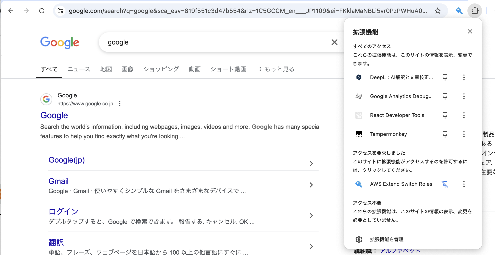
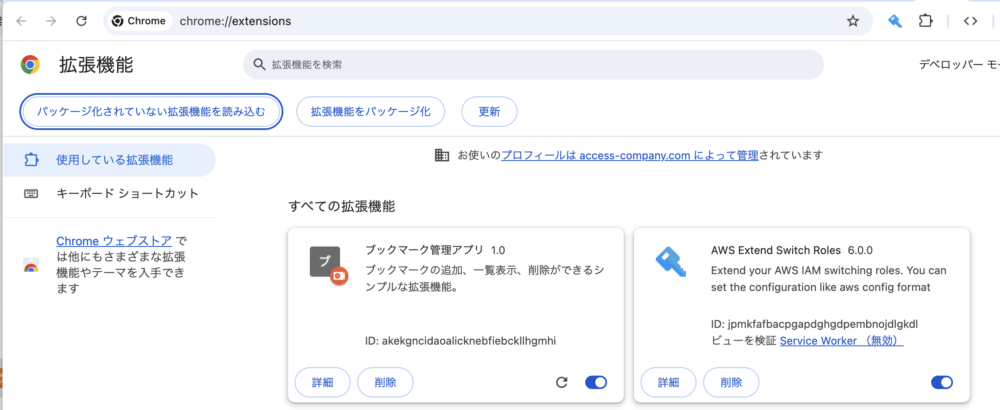
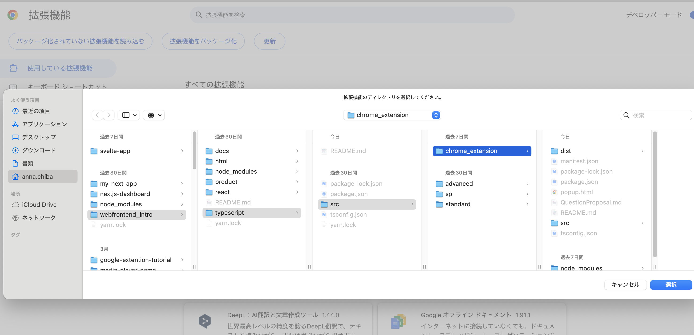

# TypeScriptでGoogle拡張機能を作ってみよう

タイトル、URL、カテゴリを入力できるブックマーク管理アプリを作成してみよう

## サンプル

<video controls width="600">
  <source src="./assets/images/chrome_extension_sample.mov" type="video/mp4">
</video>

## やり方

1. URL横にある拡張機能マークをクリックし、Google拡張機能を管理をクリックする

2. パッケージ化されていない拡張機能を読み込むをクリック

3. chrome_extensionディレクトリを選択

